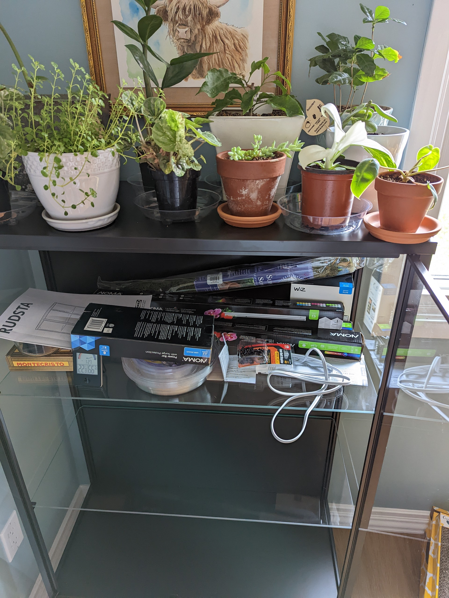
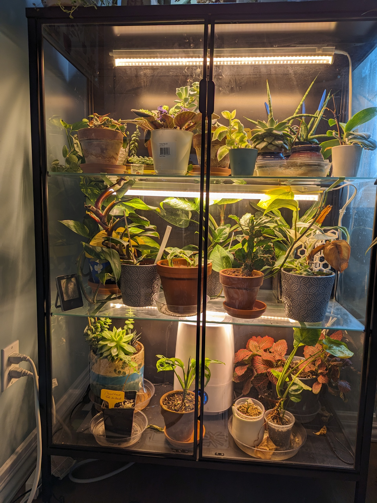

<!-- 
_header: ""
_footer: ""
_paginate: skip 
-->

<!--
Welcome everyone to our presentation on the captivating world of house plants.
Mention that you'll be sharing insights, tips, and personal experiences that will inspire everyone to connect with nature through house plants.
-->

# Embracing Green Serenity 
## Exploring the World of House Plants
By: Alex Major

---

In a bustling world filled with technology and fast-paced living, there exists a tranquil haven that many have discovered – the captivating realm of house plants. With their diverse forms, colors, and textures, house plants have the remarkable ability to transform any space into a nurturing sanctuary.

---
<!--
Introduce Jeff, your beloved Golden Pothos, inherited from your grandmother.
Share how it has become a family heirloom.
Mention the cuttings you've shared with your sisters.
-->
 # Jeff the Golden Pothos
 ## A Living Family Heirloom

 Jeff's lush foliage embodies generations of green-thumb wisdom as a living heirloom from my grandmother. Years of care have seen Jeff flourish, and his cuttings have become cherished gifts among siblings. Through Jeff, I have explore propagation's art, nurturing both plants and bonds.

 ---

<!-- 
_header: ""
_footer: ""
_paginate: false
_class:
 -->
 |                                                        |
 | :---------------------------------------------------------------------------------------------------------: |
 | *Jeff Jr. (left) & Jeff (right) enjoying other pals on top of my heirloom display case taken November 2022* |

---
<!-- 
_paginate: false
-->

<!--
Transition to your exploration beyond big box stores and into the world of small businesses and social media.
Briefly introduce the small businesses you discovered (succulent shop, plant supplies store, etc.).
Highlight the role of social media in broadening your plant horizons and connecting you with like-minded plant enthusiasts.
-->

# Exploring New Plant Horizons
## From Big Box Stores to Online Boutique

---

As my fascination with house plants deepened, I decided to venture beyond the familiar aisles of big box stores. Scrolling through Instagram, I stumbled upon [We Pot Plants][wepotplants]. Little did I know that this virtual discovery would open the door to a world of captivating plants.

---
<!-- _class: -->

# We Pot Plants

Thanks to [We Pot Plants][wepotplants], I was introduced to plant varieties that I hadn't even known existed. Syngonium with its delicate leaves, alocasia with its dramatic presence, the trailing beauty of a philodendron, and the iconic monstera - each plant brought its own unique charm into my growing indoor jungle.

---
<!-- _paginate: false -->

# Growing My Plant Family
## Exploring Small Businesses & Sharing on Social Media

---

 I kept searching for small businesses like [Tea Time Succulents][teatime], [From Desert to Jungle][desert], [Indoor Farmer][farmer], and even [Living Junglee][netherlands] all the way from the Netherlands. I've not only bought a variety of plants from these places but also stocked up on essentials like pots, supports, fertilizers, and home decor. Additionally, I've started my own little plant-focused [Instagram][me] to share my passion.

---

<!-- 
Introduce the pivotal moment when your growing collection necessitated a DIY greenhouse cabinet.
Explain your inspiration for this project, driven by the need for increased humidity and lighting.
-->

# Creating My Plant Haven
## DIY Greenhouse Cabinet

___

<!-- 
_paginate: none 
_header: ""
 -->

1) **Get the Gear:** Purchase an IKEA Rudsta Cabinet.
2) **Build it Up:** Assemble the cabinet following the provided instructions.
3) **Wiring Convenience:** Drill holes for wire runs inside the cabinet.
4) **Let There Be Light:** Attach LED Grow Light Strips, a Humidifier, and CPU fans.
5) **Time to Shine:** Plug everything into a power strip with lights set on a timer.
6) **Plant Paradise:** Add cherished plants.

---
<!-- 
Left: September 5 2022
Right: August 18 2023
 -->

---

 # Growing Green
 ## Nurturing a Thriving Plant Collection

---

After setting up the DIY greenhouse cabinet, my plant adventure kept going strong. I collected more plants and helped them multiply through propagation. Now, I have over 60 unique plants in my collection. The joy of caring for these plants is still very much alive, giving me daily inspiration and calmness.

---

# Thank you
## Any Questions?

[me]:https://www.instagram.com/amajor.plants/
[wepotplants]:https://wepotplants.com/
[teatime]:https://teatimesucculents.ca/
[netherlands]:https://www.etsy.com/shop/LivingJunglee
[desert]:https://www.fromdeserttojungle.ca/
[farmer]:https://indoorfarmer.ca/
